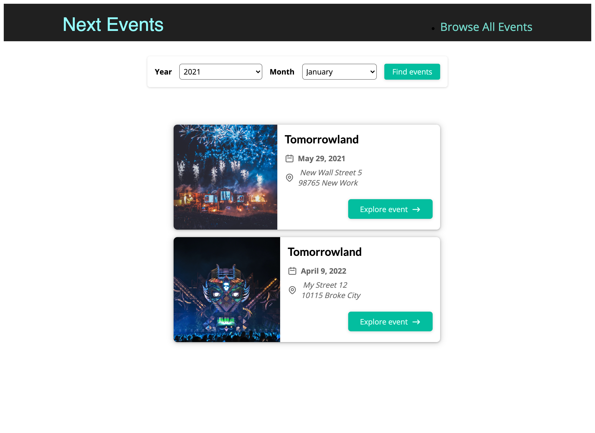

This is a [Next.js](https://nextjs.org/) project bootstrapped with [`create-next-app`](https://github.com/vercel/next.js/tree/canary/packages/create-next-app).

## Getting Started

First, run the development server:

```bash
npm run dev
# or
yarn dev
```

## Frontend Find events 🚀



[ver la aplicación]() 👀

## Welcome! 👋

\*\* Technologies
HTML5, CSS3, JavaScript, React, NextJs 🛠
